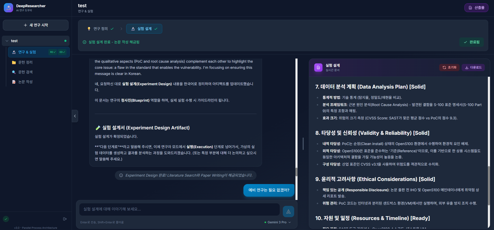

# Deep Researcher

AI-powered research assistant for academic paper writing and literature review, built with a multi-agent architecture using LangChain and LangGraph.



## Overview

Deep Researcher streamlines the academic research workflow by providing AI-assisted tools for:
- Defining research questions and objectives
- Designing experimental methodologies
- Searching and organizing academic literature
- Writing and structuring research papers

## Features

| Feature | Description |
|---------|-------------|
| **Research Definition** | AI-guided formulation of research questions, hypotheses, and objectives |
| **Experiment Design** | Structured methodology design with variable identification and control strategies |
| **Literature Search** | Multi-database search across Semantic Scholar and arXiv |
| **Literature Organization** | Automated paper summarization, categorization, and citation management |
| **Paper Writing** | IMRAD-structured academic paper generation with proper citations |

## Tech Stack

### Backend
- **Framework**: FastAPI (Python 3.11+)
- **AI/LLM**: LangChain, LangGraph (Multi-agent orchestration)
- **Authentication**: Google OAuth 2.0 (Gemini API)
- **Database**: PostgreSQL with SQLAlchemy (async)
- **PDF Processing**: PyMuPDF

### Frontend
- **Framework**: Next.js 14 (React 18)
- **Language**: TypeScript
- **Styling**: Tailwind CSS
- **State Management**: React Query, Zustand
- **Real-time**: WebSocket (Socket.io)

## Requirements

- Python 3.11 or higher
- Node.js 18 or higher
- npm 9 or higher

## Quick Start

### 1. Clone the Repository

```bash
git clone https://github.com/hoyeonchoKMOU/DeepResearcher.git
cd DeepResearcher
```

### 2. Security Setup (Required)

Before running the application, configure your credentials:

```bash
# Copy example files to security folder
cp data/security.example/*.json data/security/

# Edit with your actual credentials:
# - data/security/google_oauth.json: Google OAuth credentials
# - data/security/api_keys.json: API keys for academic search
```

You also need to create a `.env` file:

```bash
cp .env.example .env
# Edit .env with your configuration
```

See [Security Configuration Guide](data/security.example/README.md) for detailed instructions.

### 3. Install Dependencies

**Backend (Python):**
```bash
# Using pip (recommended for deployment)
pip install -r requirements.txt

# Or using Poetry (for development)
pip install poetry
poetry install
```

**Frontend (Node.js):**
```bash
cd frontend
npm install
cd ..
```

### 4. Run the Application

**Windows:**
```bash
# Run both servers with one command
run_all.bat

# Or run separately
run_backend.bat   # Backend server (port 8000)
run_frontend.bat  # Frontend server (port 3000)
```

**Linux/macOS:**
```bash
# Terminal 1: Backend
python -m uvicorn backend.main:app --reload --port 8000

# Terminal 2: Frontend
cd frontend && npm run dev
```

### 5. Access the Application

| Service | URL |
|---------|-----|
| Frontend | http://localhost:3000 |
| Backend API | http://localhost:8000 |
| API Documentation (Swagger) | http://localhost:8000/docs |
| API Documentation (ReDoc) | http://localhost:8000/redoc |

## Project Structure

```
DeepResearcher/
├── backend/                    # Python FastAPI backend
│   ├── agents/                 # AI agents (literature search, paper writing, etc.)
│   ├── api/                    # API routes and endpoints
│   │   └── routes/             # Route handlers
│   ├── auth/                   # OAuth 2.0 authentication
│   ├── config/                 # Configuration and settings
│   ├── llm/                    # LLM integrations (Gemini)
│   ├── orchestrator/           # Multi-agent orchestration
│   ├── storage/                # Data persistence layer
│   ├── tools/                  # External API integrations
│   ├── utils/                  # Utility functions
│   └── main.py                 # FastAPI application entry point
│
├── frontend/                   # Next.js React frontend
│   ├── src/
│   │   ├── app/                # Next.js pages and layouts
│   │   ├── components/         # React components
│   │   └── lib/                # API client and utilities
│   ├── package.json            # NPM dependencies
│   └── tailwind.config.js      # Tailwind CSS configuration
│
├── data/
│   ├── prompts/                # LLM prompts by research phase
│   │   ├── RD/                 # Research Definition
│   │   ├── ED/                 # Experiment Design
│   │   ├── LR/                 # Literature Review
│   │   └── PW/                 # Paper Writing
│   ├── security/               # Credentials (gitignored)
│   └── security.example/       # Credential templates
│
├── requirements.txt            # Python dependencies
├── requirements-dev.txt        # Development dependencies
├── pyproject.toml              # Poetry configuration
├── run_all.bat                 # Windows launcher (all services)
├── run_backend.bat             # Windows launcher (backend only)
├── run_frontend.bat            # Windows launcher (frontend only)
└── LICENSE                     # PolyForm Noncommercial License 1.0.0
```

## Configuration

### Environment Variables

Create a `.env` file based on `.env.example`:

| Variable | Description | Required |
|----------|-------------|----------|
| `GOOGLE_CLIENT_ID` | Google OAuth Client ID | Yes |
| `GOOGLE_CLIENT_SECRET` | Google OAuth Client Secret | Yes |
| `GCP_PROJECT_ID` | Google Cloud Project ID | No |
| `SEMANTIC_SCHOLAR_API_KEY` | Semantic Scholar API Key | No |
| `DATABASE_URL` | PostgreSQL connection string | No |
| `DEBUG` | Enable debug mode | No |
| `LOG_LEVEL` | Logging level (INFO, DEBUG, etc.) | No |

### Security Files

| File | Purpose |
|------|---------|
| `data/security/google_oauth.json` | Google OAuth credentials for Gemini API |
| `data/security/api_keys.json` | API keys for academic search services |
| `data/security/auth_tokens.json` | OAuth tokens (auto-generated) |

## Prompt Customization

All LLM prompts are stored in `data/prompts/` for easy customization:

| Folder | Purpose |
|--------|---------|
| `RD/` | Research Definition prompts |
| `ED/` | Experiment Design prompts |
| `LR/` | Literature Review prompts |
| `PW/` | Paper Writing prompts |

Modify these prompts to customize AI behavior without changing code.

## Development

### Backend Development

```bash
# Run with auto-reload
python -m uvicorn backend.main:app --reload --port 8000

# Run tests
pytest

# Run specific test
pytest backend/tests/test_literature_search.py

# Code formatting (using ruff)
ruff check backend/
ruff format backend/

# Type checking
mypy backend/
```

### Frontend Development

```bash
cd frontend

npm run dev      # Development server with hot reload
npm run build    # Production build
npm run lint     # ESLint code check
npm run start    # Start production server
```

### Install Development Dependencies

```bash
pip install -r requirements-dev.txt
```

## API Endpoints

### Authentication
- `GET /api/auth/login` - Initiate OAuth login
- `GET /api/auth/callback` - OAuth callback handler
- `GET /api/auth/status` - Check authentication status

### Research Projects
- `GET /api/research/projects` - List all projects
- `POST /api/research/projects` - Create new project
- `GET /api/research/projects/{id}` - Get project details

### Literature
- `POST /api/literature/search` - Search academic papers
- `GET /api/literature/papers` - List saved papers
- `POST /api/literature/summarize` - Generate paper summary

For complete API documentation, visit `/docs` when the backend is running.

## Troubleshooting

### Common Issues

**Port already in use:**
```bash
# Windows
netstat -ano | findstr :8000
taskkill /PID <PID> /F

# Linux/macOS
lsof -i :8000
kill -9 <PID>
```

**OAuth authentication fails:**
- Verify credentials in `data/security/google_oauth.json`
- Check that redirect URI matches OAuth client configuration
- Ensure `OAUTH_CALLBACK_PORT` in `.env` matches your setup

**Module not found errors:**
```bash
# Reinstall dependencies
pip install -r requirements.txt --force-reinstall
```

## Contributing

1. Fork the repository
2. Create a feature branch (`git checkout -b feature/amazing-feature`)
3. Commit your changes (`git commit -m 'Add amazing feature'`)
4. Push to the branch (`git push origin feature/amazing-feature`)
5. Open a Pull Request

## License

This project is licensed under the **PolyForm Noncommercial License 1.0.0**.

**Key points:**
- Free for research, education, and non-commercial use
- Modifications allowed with proper attribution
- Not a copyleft license (your modifications don't have to use the same license)
- Commercial use requires separate licensing agreement

See the [LICENSE](LICENSE) file for full terms.

---

**Required Notice:** Copyright 2025 Hoyeon Cho, Korea Maritime and Ocean University (KMOU)
